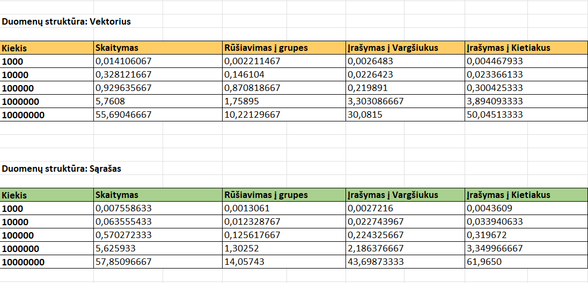

# Studentų analizė

## Struktūra
### Struct Studentas
- `string vardas`: Studento vardas.
- `string pavarde`: Studento pavarde.
- `vector <double> nd`: Namų darbų įvertinimų vektorius.
- `double egz`: Egzamino įvertinimas
- `double galutinis_vid`: Galutinis įvertinimas pagal vidurkį
- `double galutinis_med`: Galutinis įvertinimas pagal medianą

## Aprašymas
Vartotojui suteikiamas pasirinkimas tarp duomenų įvedimo ranka, nuskaitymo iš failo, failų generavimo (generuojami 5 testiniai failai) ir failų testavimo. Vartotojui pasirinkus įvedima ranka, vartotojas privalo įvesti kiekį studentų, kuriuos nori įvesti į sistemą, taip pat privalo pateikti jų varbus bei pavardes, yra suteikiama galimybė namų darbų bei egzamino įvertinimus generuoti atsitiktinai dešimtbalėje sistemoje. Pagal vartotojo įvestus ar sugeneruotus duomenis yra apskaičiuojamas galutinis įvertinimas pagal vidurkį ir galutinis įvertinimas pagal medianą. Resultatai pateikiami pagal pasirinkimą arba terminale arba 'Rez.txt' faile. Vartotojui pasirinkus failo nuskaitymą, reikės suvesti failo pavadinimą ir bus atlikti tokie patys veiksmai kaip ir su įvedimu ranka. Vartotojui pasirinkus failų generavimą bus sugeneruoti 5 failai su įrašų kiekių: 1000, 10000, 100000, 1000000, 10000000. Vartotojui pasirinkus failų testavimą, pasirinkus ir įvedus norimo failo pavadinimą bus atliktie tokie veiksai: studentų rezultatai bus apskaičiuoti ir įrašyti į 'Rez.txt' failą, studentai rūšiuojami pagal vardą ir pavardę, pavardę ir vardą, galutionio įvertinimo mažėjimo arba didėjimo tvarka, studentai bus suskirstomi į dvi grupes pagal galutinį įvertinimą į 'vargškiukus'(galutinis balas < 5.0 ) ir 'kietiakus' (galutinis balas >= 5.0), sugrupuoti duomenis įrašomi į skirtingus failus.

## Programos veikimo greičio (spartos) analizė:

### Failų generavimo laikas:
- `1000` įrašų: **0.0038736 s.**
- `10000` įrašų: **0.02257958 s.**
- `100000` įrašų: **0.192953 s.**
- `1000000` įrašų: **1.9046325 s.**
- `10000000` įrašų: **19.2343 s.**

### Testavimo laikai:

### Trumpa analizė:
- **Duomenų skaitymas:** Sąrašas (list) greičiau nuskaitynėja duomenis mažesniose failuose, tačiau vektorius (vector) greičiau skaito failą su 10 mln. įrašų.
- **Rūšiavimas į grupes:** Sąrašas greičiau rūšiuoja, skirsto į dvi grupes duomenis mažesniose failuose, tačiau vektorius greičiau skirsto failą su 10 mln. įrašų.
- **Įrašymas į failus:** Tiek sąrašas, tiek vektorius užtrunka panašiai laiko įrašydamas duomenis į "Vargšiukus" ir "Kietiakus" failus. Tačiau vektorius greičiau įrašynėja su didesniu kiekiu įrašų (10 mln.).

## Testavimo sistemos parametrai:

- CPU - AMD Ryzen 7 7730U with Radeon Graphics  2.00 GHz
- RAM - 16.0 GB
- SSD - INTEL SSDPEKNU512GZH

## Kaip naudotis programa:

Paleidus programą jūs pamatysite pasirinkimą dėl duomenų struktūros, rinktis reikės tarp vektoriaus arba sąrašo, galite rinktis kurį norite, rezultatas nuo to nepasikeis, gali pasikeisti tik vykdymo laikas. Atsakius į šį klausimą, jus pasitiks kitas, reikės pasirinkti dėl programos vykdymo, reikės įvestį raidę, kurį atstovaus jūsų pasirinkimą.

### Programos vykdymo pasirinkimas:

**I - duomenų įvedimas**:
- Įveskite 'I' raidę.
- Pirmas klausimas bus šis: 'Kiek studentų norite įtraukti į sistemą:', įveskite skaičių.
- Toliau prasidės klausimai susije su pačiais studento duomenimis (šie klausimai kartosis tiek kartų, kiek nurodėte studentų):
    - Reikės pateikti vardą bei pavardę;
    - Pasirinkti dėl namų darbų bei egzamino įvertinimų įrašymo ranka ar atsitiktinio generavimo.
    - Jei pasirinksite `taip`, tai duomenis bus sugeneruoti atsitiktinai dešimtbalėje skaičiavimo sistemoje, tačiau reikės nurodyti norimą namų darbų kiekį.
    - Jei pasirinkite `ne`, tai duomenis reikės įvesti ranka. (pavyzdys: '8' spaudžiate 'enter' klavišą, tada įvedate '9' ir vėl spaudžiate 'enter' klavišą, norėdami užbaigti įvedimą, spauskite du kart 'enter' klavišą).
- Kitame klausime bus klausiama dėl rezultatų, ar norite, kad bendras įvertinimas būtų apskaičiuotas naudojant vidurkį ar medianą. (Galutinis = 0.4 * vidurkis (arba medianą) + 0.6 * egzaminas).
- Toliau reikės pasirinkti dėl studentų duomenų rūšiavimo: pagal vardą ir pavarde - 'VP', pagal pavardę ir vardą - 'PV', pagal galutinį įvertinimą mažėjančia tvarka - 'GM', pagal galutinį įvertinimą didėjančia tvarka - 'GD'.
- Toliau reikės pasirinkti kur norite matyti rezultatus ar terminale (ten kur atsakinėjant į klausimus) ar išvesti juos į rezultatų failą. Tai pasirinksite tarp 'T' - terminalas ir 'F' - Failas.
- Pasirinkus 'T' atsakymai iš kart bus pateikti terminale.
- Pasirinkus 'F' atsakymai bus pateikti 'rez.txt' faile, kurį rasite sugeneruotame aplankale su pavadinimų 'Release'.

**N - duomenų nuskaitymas iš failo**:
- Įveskite 'N' raidę.
- Toliau reikės įvesti norimo failo pavadinimą. Tačiau pirmiausia įkelkite norimą failą į jau sugeneruotą aplankalą pavadinimu 'Release'.
- Kitame klausime klaus dėl rezultatų, ar norite, kad bendras įvertinimas būtų apskaičiuotas naudojant vidurkį ar medianą. (Galutinis = 0.4 * vidurkis (arba medianą) + 0.6 * egzaminas)
- Toliau reikės pasirinkti dėl studentų duomenų rūšiavimo: pagal vardą ir pavarde - 'VP', pagal pavardę ir vardą - 'PV', pagal galutinį įvertinimą mažėjančia tvarka - 'GM', pagal galutinį įvertinimą didėjančia tvarka - 'GD'.
- Toliau reikės pasirinkti kur norite matyti rezultatus ar terminale (ten kur atsakinėjant į klausimus) ar išvesti juos į rezultatų failą. Tai pasirinksite tarp 'T' - terminalas ir 'F' - Failas. Didesnius failus rekomenduojama išvesti į 'rez.txt' failą.
- Pasirinkus 'T' atsakymai iš kart bus pateikti terminale.
- Pasirinkus 'F' atsakymai bus pateikti 'rez.txt' faile, kurį rasite sugeneruotame aplankale su pavadinimų 'Release'.

**G - atsitiktinių duomenų generavimas**:
**T - failų testasvimas**:
