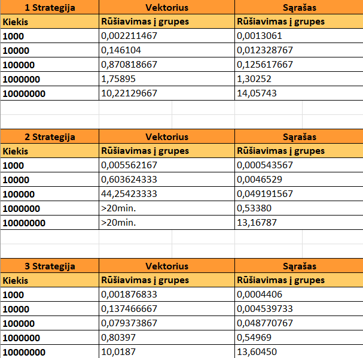

# Studentų analizė

## Programos diegimo ir paleidimo instrukcija:

Norint įdiegti ir paleisti programą sekite šiuos žingsnius:
- Atsisiųskite v1.0 versiją eidami į "Releases", pasirinkite v1.0 versiją ir paspauskite ant *Source code (zip)*;
- Išskleiskite atsisiųstą failą "OOP-v1.0.zip";
- Dukart spustelėkite ant failo "run.bat" ir šiek tiek palaukite;
- Sekite ekrane pateiktas instrukcijas arba vadovaukitės žemiau pateikta programos naudojimosi instrukcija.

Jeigu visus žingsnius atlikote teisingai, tai tame pačiame aplankale turėjo susikurti naujas aplankalas pavadinimu "Release", paspaude ir užėje į aplankalą, matysite aplikacija pavadinimu "Students_analysis", kuria paspaudus du kartus galėsite testi savo darbus.

## Kaip naudotis programa:

Paleidus programą jūs pamatysite pasirinkimą dėl **duomenų struktūros**, rinktis reikės tarp vektoriaus arba sąrašo, galite rinktis kurį norite, rezultatas nuo to nepasikeis, gali pasikeisti tik vykdymo laikas. Atsakius į šį klausimą, jūs pasitiks kitas, reikės pasirinkti dėl **programos vykdymo**, reikės įvestį raidę, kuri atstovaus jūsų pasirinkimą.

### Programos vykdymo pasirinkimas:

***'I' - duomenų įvedimas***:
- Įveskite 'I' raidę.
- Pirmas klausimas bus šis: 'Kiek studentų norite įtraukti į sistemą:', įveskite skaičių.
- Toliau prasidės klausimai susije su pačiais studento duomenimis (šie klausimai kartosis tiek kartų, kiek nurodėte studentų):
    - Reikės pateikti vardą bei pavardę;
    - Pasirinkti dėl namų darbų bei egzamino įvertinimų įrašymo ranka ar atsitiktinio generavimo.
    - Jei pasirinksite `taip`, tai duomenis bus sugeneruoti atsitiktinai dešimtbalėje skaičiavimo sistemoje, tačiau reikės nurodyti norimą namų darbų kiekį.
    - Jei pasirinkite `ne`, tai duomenis reikės įvesti ranka. (pavyzdys: '8' spaudžiate 'enter' klavišą, tada įvedate '9' ir vėl spaudžiate 'enter' klavišą, norėdami užbaigti įvedimą, spauskite du kart 'enter' klavišą).
- Kitame klausime bus klausiama dėl rezultatų, ar norite, kad bendras įvertinimas būtų apskaičiuotas naudojant vidurkį (V) ar medianą (M). (Galutinis = 0.4 * vidurkis (arba medianą) + 0.6 * egzaminas).
- Toliau reikės pasirinkti dėl studentų duomenų rūšiavimo: pagal vardą ir pavarde - 'VP', pagal pavardę ir vardą - 'PV', pagal galutinį įvertinimą mažėjančia tvarka - 'GM', pagal galutinį įvertinimą didėjančia tvarka - 'GD'.
- Toliau reikės pasirinkti kur norite matyti rezultatus ar terminale (ten kur atsakinėjant į klausimus) ar išvesti juos į rezultatų failą. Tai pasirinksite tarp 'T' - terminalas ir 'F' - Failas.
- Pasirinkus 'T' atsakymai iš kart bus pateikti terminale.
- Pasirinkus 'F' atsakymai bus pateikti 'rez.txt' faile, kurį rasite sugeneruotame aplankale su pavadinimų 'Release'.

***'N' - duomenų nuskaitymas iš failo***:
- Įveskite 'N' raidę.
- Toliau reikės įvesti norimo failo pavadinimą. Tačiau pirmiausia įkelkite norimą failą į jau sugeneruotą aplankalą pavadinimu 'Release'.
- Kitame klausime klaus dėl rezultatų, ar norite, kad bendras įvertinimas būtų apskaičiuotas naudojant vidurkį (V) ar medianą (M). (Galutinis = 0.4 * vidurkis (arba medianą) + 0.6 * egzaminas)
- Toliau reikės pasirinkti dėl studentų duomenų rūšiavimo: pagal vardą ir pavarde - 'VP', pagal pavardę ir vardą - 'PV', pagal galutinį įvertinimą mažėjančia tvarka - 'GM', pagal galutinį įvertinimą didėjančia tvarka - 'GD'.
- Toliau reikės pasirinkti kur norite matyti rezultatus ar terminale (ten kur atsakinėjant į klausimus) ar išvesti juos į rezultatų failą. Tai pasirinksite tarp 'T' - terminalas ir 'F' - Failas. Didesnius failus rekomenduojama išvesti į 'rez.txt' failą.
- Pasirinkus 'T' atsakymai iš kart bus pateikti terminale.
- Pasirinkus 'F' atsakymai bus pateikti 'rez.txt' faile, kurį rasite sugeneruotame aplankale su pavadinimų 'Release'.

***'G' - atsitiktinių duomenų generavimas***:
- Įveskite 'G' raidę.
- Programa sugeneruos 5 studentų duomenų failus su įrašų kiekių: 1000, 10000, 100000, 1000000, 10000000.
- Failų pavadinimai priklauso nuo įrašų kiekio:
    - Studentai_1000.txt
    - Studentai_10000.txt
    - Studentai_100000.txt
    - Studentai_1000000.txt
    - Studentai_10000000.txt
- Šie failai atsiras naujai sukurtame aplankale su pavadinimu 'Release'.

***'T' - failų testasvimas***:
- Įveskite 'T' raidę.
- Reikės pasirinkti strategiją, tai pasirinkite kuria norite, rekomenduodama 3 strategija. (Strategijų aprašymą rasite žemiau).
- Kitame klausime klaus dėl rezultatų, ar norite, kad bendras įvertinimas būtų apskaičiuotas naudojant vidurkį (V) ar medianą (M). (Galutinis = 0.4 * vidurkis (arba medianą) + 0.6 * egzaminas)
- Toliau reikės pasirinkti dėl studentų duomenų rūšiavimo: pagal vardą ir pavarde - 'VP', pagal pavardę ir vardą - 'PV', pagal galutinį įvertinimą mažėjančia tvarka - 'GM', pagal galutinį įvertinimą didėjančia tvarka - 'GD'.
- Kad prasidėtų testavimas jums reikės pateikti duomenų failo pavadinimą. Tačiau pirmiausia įkelkite norimą failą į jau sugeneruotą aplankalą pavadinimu 'Release' arba įveskite pavadinimą iš jau automatiškai sugeneruotų failų, jei anksčiau leidote programą ir įvedėte 'S'.
- Daugiau nieko nebereikės pasirinkti, testavimas bus atliktas ir pamatysite atliktus veiksmus ir dalie jų vykdymo laikus.
- Testavimo metu atliekami šie veiksmai:
    - Duomenų nuskaitymas iš failo.
    - Galutinių įvertinimų skaičiavimas.
    - Studentų duomenų rūšiavimas.
    - Rezultatų atspausdinimas į 'rez.txt' failą.
    - Studentai bus suskirstomi į dvi grupes pagal galutinį įvertinimą į 'vargškiukus'(galutinis balas < 5.0 ) ir 'kietiakus' (galutinis balas >= 5.0) pagal pasirinktą strategiją.
    - Studentų duomenis bus pateikti failuose: 'rez.txt', 'Vargsiukai.txt', 'Kietiakai.txt' failuose.
- Rezultatų failus rasite naujai sukurtame aplankale su pavadinimu 'Release'.

## Release'ų aprašymas:

- ***v0.1 pradinėje*** versijoje sukūriama 'Studentas' struktūra studento duomenims saugoti. Vartotojas privalo įvesti kiekį studentų, kuriuos nori įtraukti į sistemą, pateikti jų varbus bei pavardes, gali įvertinimų duomenis įvesti ranka arba sugeneruoti atsitiktinai dešimtbalėje skačiavimo sistemoje. Pagal vartotojo įvestus ar sugeneruotus duomenis yra apskaičiuojamas galutinis įvertinimas pagal vidurkį ir galutinis įvertinimas pagal medianą. Vartotojui pasirinkus norima įvertinimo būdą yra atspausdinama lentelė su pateiktais įvertinimais.

- ***v0.1*** versijoje programos vykdymo pasirinkimas yra papildomas duomenų nuskaitymų iš failo (įvedus 'N' raidę) funkcija. Pasirinkus nuskaitymą vartotojas privalo pateikti duomenų failo pavadinimą. Taip pat, įvestas naujas pasirinkimas vartotojui dėl studentų rezultatų išvedimo, pasirinkus 'T' - rezultatas išvedamas terminale, ekrane, pasirinkus 'F' - rezultatas išvedamas 'rez.txt' faile. Rezultatai pateikiami surūšiuoti pagal vardus (ar pavardes), vartotojo įvedimams tikrinti yra panaudojamas išimčių valdymas.

- ***v0.2*** versija yra papildoma studentų duomenų failų generavimų. Yra sugeneruojami 5 failai, sudaryti iš: 1 000, 10 000, 100 000, 1 000 000, 10 000 000 įrašų. Studentai yra suskirstomi į dvi kategorijas (galutinis balas < 5.0 - 'Vargsiukus', galutinis balas >= 5.0 - 'Kietiakus') ir atspausdinimi skiringuose failuose pagal jas. Su sugeneruotais failais atlikta programos veikimo greičio (spartos) analizė.

- ***v0.3*** versija yra papildoma pasirinkimu, dirbti ne tik su vektoriu, bet ir su sąrašu.

- ***v1.0*** versija yra papildoma trejomis strategijomis, kurios skirtos studentų skirstymui į dvi grupes. (Strategijos aprašomos žemiau).

## Strategijų aprašymas: (Skirtos studentų skaidymui į dvi grupes)

- ***1 strategija*** Bendro studentai konteinerio (vector ir list tipų) skaidymas į du naujus to paties tipo konteinerius: "vargšiukų" ir "kietiakų". Tokiu būdu tas pats studentas yra dvejuose konteineriuose: bendrame studentai ir viename iš suskaidytų (vargšiukai arba kietiakai). 

- ***2 strategija*** Bendro studentų konteinerio (vector ir list) skaidymas panaudojant tik vieną naują konteinerį: "vargšiukai". Tokiu būdu, jei studentas yra vargšiukas, jį turime įkelti į naująjį "vargšiukų" konteinerį ir ištrinti iš bendro studentai konteinerio. Po šio žingsnio studentai konteineryje liks vien tik kietiakai.

- ***3 strategija*** Bendro studentų konteinerio (vector ir list) skaidymas (rūšiavimas) panaudojant 1 ir 2 strategiją. Jei konteineris yra parenkamas vektoriu, tai atliekama pirma strategija su funkcija 'std::stable_partition', jei sąrašu - atliekama antra strategija.

## Programos veikimo greičio (spartos) analizė ir Release'ų resultatų analizė:

### Failų generavimo laikas:
- `1000` įrašų: **0.0038736 s.**
- `10000` įrašų: **0.02257958 s.**
- `100000` įrašų: **0.192953 s.**
- `1000000` įrašų: **1.9046325 s.**
- `10000000` įrašų: **19.2343 s.**

### Testavimo laikai:

('Rūšiavimas į grupes' - skaidymas į grupes, buvo naudojama 1 strategija).

### Trumpa analizė:
- **Duomenų skaitymas:** Sąrašas (list) greičiau nuskaitynėja duomenis mažesniose failuose, tačiau vektorius (vector) greičiau skaito failą su 10 mln. įrašų.
- **Rūšiavimas į grupes:** Sąrašas greičiau rūšiuoja, skirsto į dvi grupes duomenis mažesniose failuose, tačiau vektorius greičiau skirsto failą su 10 mln. įrašų.
- **Įrašymas į failus:** Tiek sąrašas, tiek vektorius užtrunka panašiai laiko įrašydamas duomenis į "Vargšiukus" ir "Kietiakus" failus. Tačiau vektorius greičiau įrašynėja su didesniu kiekiu įrašų (10 mln.).

### Strategijų testavimo laikai dirbant su vektoriu ir sąrašu.

### Trumpa analizė: (Duomenų skaidymo į dvi grupes, efektyvumas laiko atžvilgiu)

- **1 Strategija:** 
    - Sąrašąs efektyviau su mažesnių kiekiu duomenų (iki 10mln).
    - Vektorius efektyviau su 10 mln. kiekiu duomenų.

- **2 Strategija:** 
    - Sąrašas visais atvejais efektyviau.

- **3 Strategija:** 
    - Sąrašąs efektyviau su mažesnių kiekiu duomenų (iki 10mln).
    - Vektorius efektyviau su 10 mln. kiekiu duomenų.

- **Rekomendacija:**
    - Naudoti 3 strategiją laiko atžvilgiu yra efektyviausia.

## Testavimo sistemos parametrai:

- CPU - AMD Ryzen 7 7730U with Radeon Graphics  2.00 GHz
- RAM - 16.0 GB
- SSD - INTEL SSDPEKNU512GZH