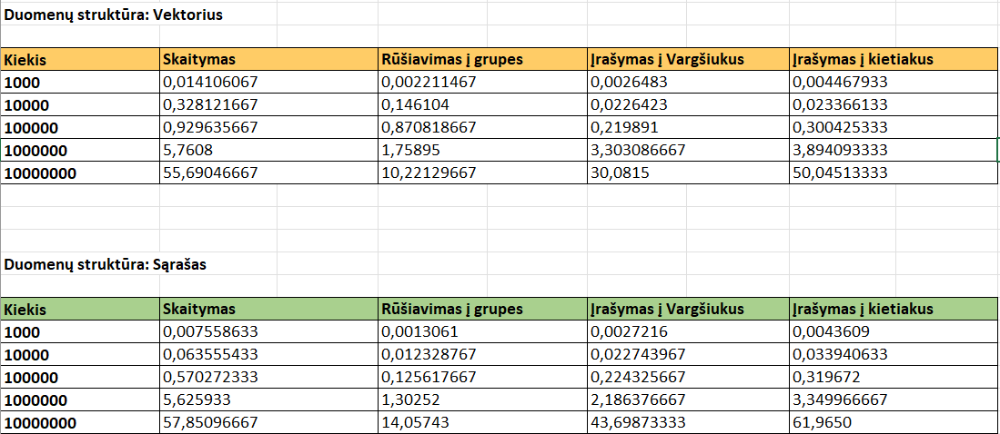

# OOP

## Struktūra
### Struct Studentas
- `string vardas`: Studento vardas.
- `string pavarde`: Studento pavarde.
- `vector <double> nd`: Namų darbų įvertinimų vektorius.
- `double egz`: Egzamino įvertinimas
- `double galutinis_vid`: Galutinis įvertinimas pagal vidurkį
- `double galutinis_med`: Galutinis įvertinimas pagal medianą

## Aprašymas
Vartotojui suteikiamas pasirinkimas tarp duomenų įvedimo ranka, nuskaitymo iš failo, failų generavimo (generuojami 5 testiniai failai) ir failų testavimo. Vartotojui pasirinkus įvedima ranka, vartotojas privalo įvesti kiekį studentų, kuriuos nori įvesti į sistemą, taip pat privalo pateikti jų varbus bei pavardes, yra suteikiama galimybė namų darbų bei egzamino įvertinimus generuoti atsitiktinai dešimtbalėje sistemoje. Pagal vartotojo įvestus ar sugeneruotus duomenis yra apskaičiuojamas galutinis įvertinimas pagal vidurkį ir galutinis įvertinimas pagal medianą. Resultatai pateikiami pagal pasirinkimą arba terminale arba 'Rez.txt' faile. Vartotojui pasirinkus failo nuskaitymą, reikės suvesti failo pavadinimą ir bus atlikti tokie patys veiksmai kaip ir su įvedimu ranka. Vartotojui pasirinkus failų generavimą bus sugeneruoti 5 failai su įrašų kiekių: 1000, 10000, 100000, 1000000, 10000000. Vartotojui pasirinkus failų testavimą, pasirinkus ir įvedus norimo failo pavadinimą bus atliktie tokie veiksai: studentų rezultatai bus apskaičiuoti ir įrašyti į 'Rez.txt' failą, studentai rūšiuojami pagal vardą ir pavardę, pavardę ir vardą, galutionio įvertinimo mažėjimo arba didėjimo tvarka, studentai bus suskirstomi į dvi grupes pagal galutinį įvertinimą į 'vargškiukus'(galutinis balas < 5.0 ) ir 'kietiakus' (galutinis balas >= 5.0), sugrupuoti duomenis įrašomi į skirtingus failus.

## Programos veikimo greičio (spartos) analizė:

### Failų generavimo laikas:
- `1000` įrašų: **0.0038736 s.**
- `10000` įrašų: **0.02257958 s.**
- `100000` įrašų: **0.192953 s.**
- `1000000` įrašų: **1.9046325 s.**
- `10000000` įrašų: **19.2343 s.**

### Testavimo laikai:

## Testavimo sistemos parametrai:

- CPU - AMD Ryzen 7 7730U with Radeon Graphics  2.00 GHz
- RAM - 16.0 GB
- SSD - INTEL SSDPEKNU512GZH